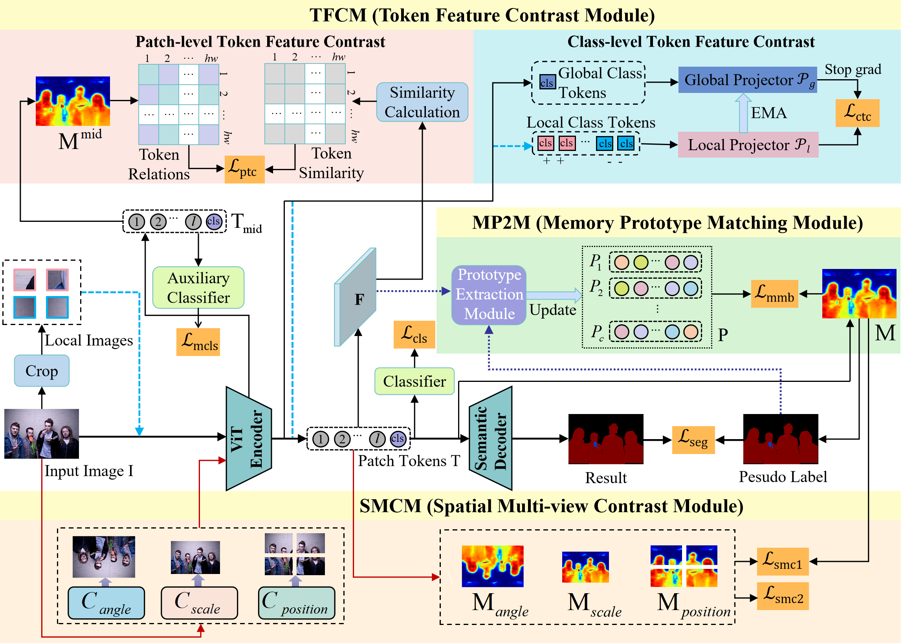

## MSFC: Multi-Source Feature Contrast network for weakly-supervised semantic segmentation

<div align="center">

<br>
  
</div>

<!-- ## Abastract -->
Weakly-Supervised Semantic Segmentation (WSSS) with image-level labels generally aims to leverage Class Activation Map (CAM) to generate pixel-level pseudo labels for guiding object segmentation. With the development of Vision Transformer (ViT), recent ViT-based methods have emerged to capture the global context for CAM optimization through the self-attention mechanism. However, constrained by the inherent semantic features in the image, this strategy can only extract limited supervised information, resulting in coarse segmentation performance. To address this issue, we propose a Multi-Source Feature Contrast (MSFC) network to fully mine sufficient supervised information from multiple sources, including token correlations, spatial correlations, and historical correlations, for achieving accurate WSSS. Specifically, based on the token mechanism of ViT, we introduce a Token Feature Contrast Module (TFCM), which employs patch-level token contrast strategy and class-level token contrast strategy to explore token correlations for effectively activating CAM regions. Next, a Spatial Multi-view Contrast Module (SMCM) is designed to learn self-supervised information for improving the CAM details by the spatial correlations of multi-view images obtained through data augmentation. In addition, a Memory Prototype Matching Module (MP2M) is proposed to fully explore the historical correlations for refining CAM based on the updatable memory bank, and an adaptive memory contrast loss is introduced to further enhance its performance. Finally, the optimized CAM is fully utilized to generate accurate pseudo labels for guiding effective object segmentation. Extensive experiments on the PASCAL VOC
2012 and MS COCO datasets demonstrate the superiority of the proposed method.


## Data Preparations
<details>
<summary>
VOC dataset
</summary>

#### 1. Download

``` bash
wget http://host.robots.ox.ac.uk/pascal/VOC/voc2012/VOCtrainval_11-May-2012.tar
tar –xvf VOCtrainval_11-May-2012.tar
```
#### 2. Download the augmented annotations
The augmented annotations are from [SBD dataset](http://home.bharathh.info/pubs/codes/SBD/download.html). Here is a download link of the augmented annotations at
[DropBox](https://www.dropbox.com/s/oeu149j8qtbs1x0/SegmentationClassAug.zip?dl=0). After downloading ` SegmentationClassAug.zip `, you should unzip it and move it to `VOCdevkit/VOC2012`. The directory sctructure should thus be 

``` bash
VOCdevkit/
└── VOC2012
    ├── Annotations
    ├── ImageSets
    ├── JPEGImages
    ├── SegmentationClass
    ├── SegmentationClassAug
    └── SegmentationObject
```
</details>

<details>

<summary>
COCO dataset
</summary>

#### 1. Download
``` bash
wget http://images.cocodataset.org/zips/train2014.zip
wget http://images.cocodataset.org/zips/val2014.zip
```
#### 2. Generating VOC style segmentation labels for COCO
To generate VOC style segmentation labels for COCO dataset, you could use the scripts provided at this [repo](https://github.com/alicranck/coco2voc). Or, just download the generated masks from [Google Drive](https://drive.google.com/file/d/147kbmwiXUnd2dW9_j8L5L0qwFYHUcP9I/view?usp=share_link).

I recommend to organize the images and labels in `coco2014` and `SegmentationClass`, respectively.

``` bash
MSCOCO/
├── coco2014
│    ├── train2014
│    └── val2014
└── SegmentationClass
     ├── train2014
     └── val2014
```


</details>


### Train
To start training, just run:
```bash
## for VOC
run train_run_VOC.sh
## for COCO
run train_run_COCO.sh
```
### Evalution
To evaluation:
```bash
## for VOC
run infer_run_VOC.sh
## for COCO
run infer_run_COCO.sh
```


